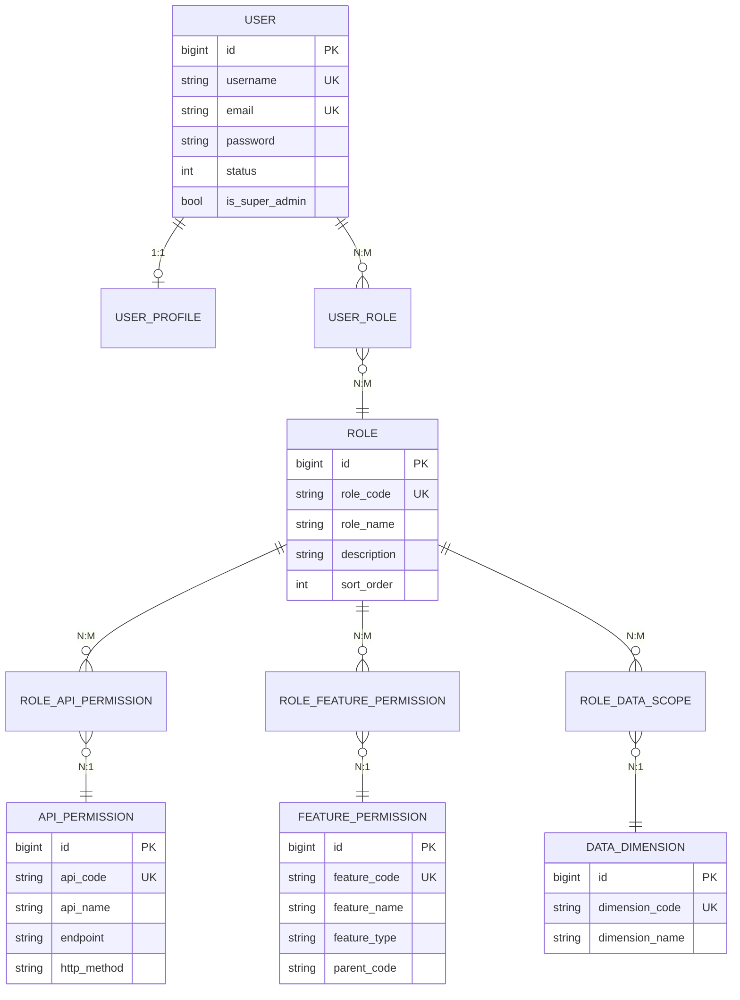
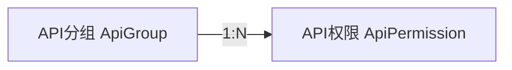
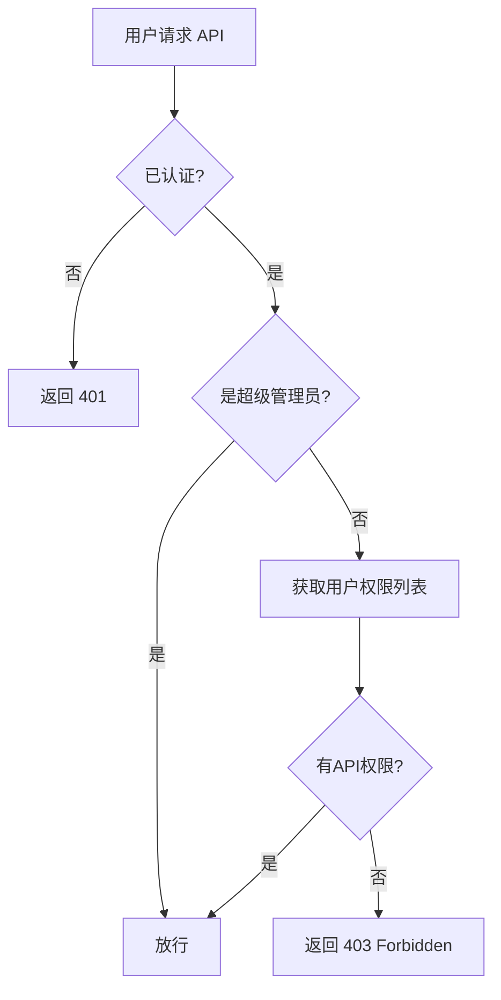
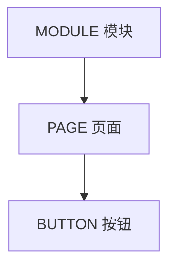
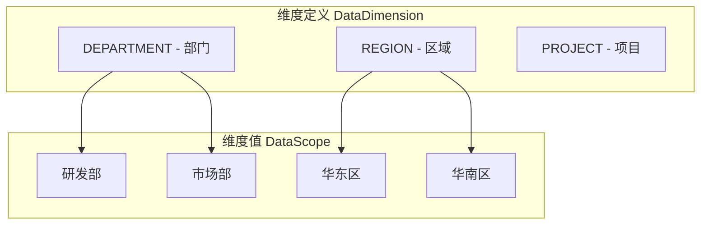
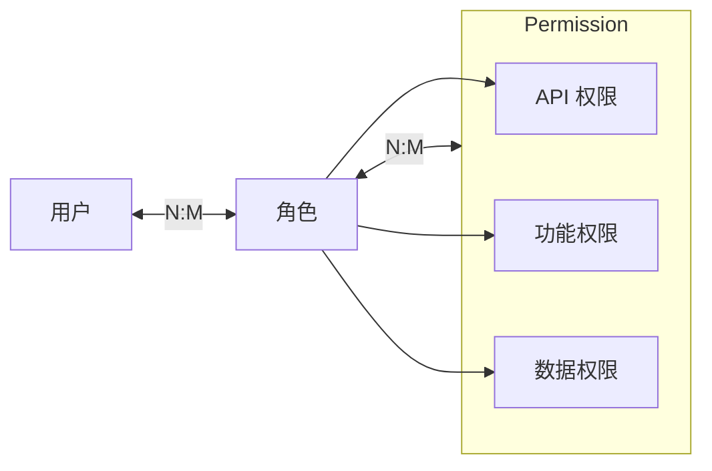
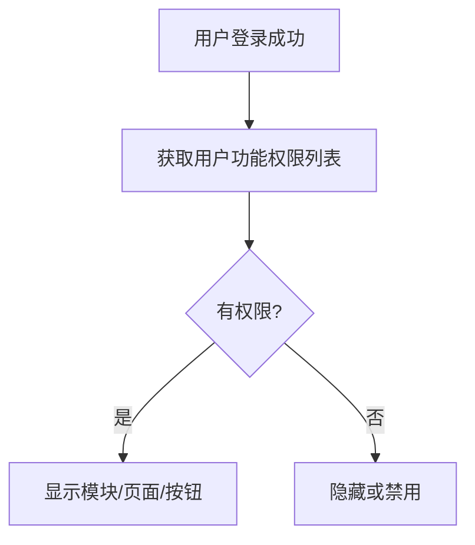
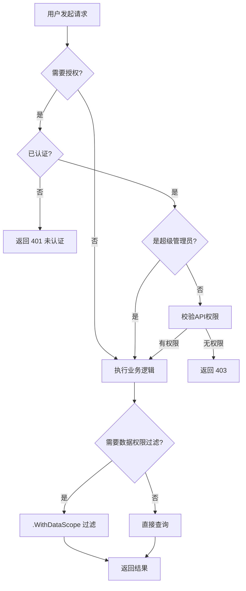
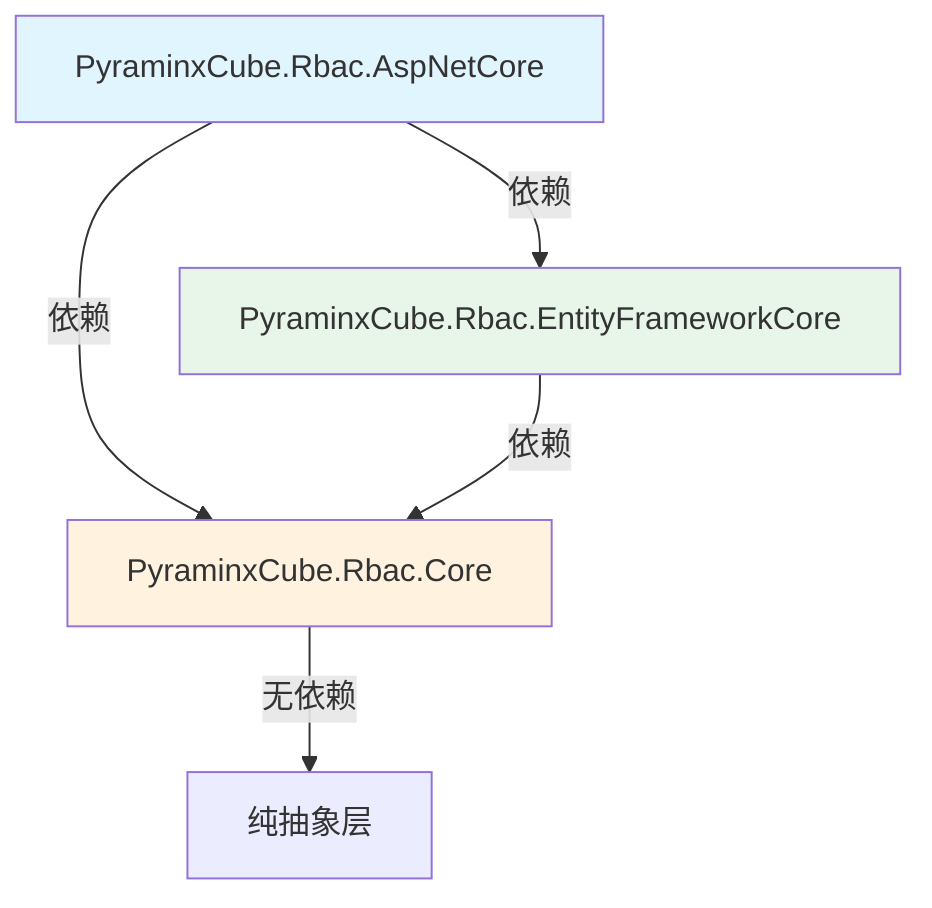

# RBAC 模块设计文档

> 本文档为 RBAC 权限管理框架的完整设计文档，涵盖模块概述、权限模型、表结构、业务流程、子项目职责及设计约束。
> 建议与 [Database_Design.md](./Database_Design.md)、[Functional_Design.md](./Functional_Design.md)、[CSharp_Implementation.md](./CSharp_Implementation.md) 配合阅读。

---

## 1. 模块整体概述

### 1.1 设计目标

构建一个**框架级**的 RBAC 权限管理系统，具备以下特性：

- **功能权限**（技术性）：精细控制每个 API 接口和前端按钮，在框架内完整实现
- **数据权限**（业务性）：提供抽象的、可配置的维度机制，具体维度由业务系统定义
- **高复用性**：可套用到各种业务系统，无需修改框架核心逻辑

### 1.2 核心设计原则

| 权限类型 | 性质 | 框架实现程度 | 说明 |
|---------|------|-------------|------|
| API 接口权限 | 技术性 | ✅ 完整实现 | 精细到每个接口 |
| 功能按钮权限 | 技术性 | ✅ 完整实现 | 精细到每个按钮 |
| 数据权限 | 业务性 | ⚡ 提供机制 | 框架只提供抽象维度机制，具体维度由业务定义 |

### 1.3 一句话总结

**功能权限在框架内完整实现，数据权限只提供抽象机制。**

---

## 2. 核心权限模型说明

### 2.1 实体关系总览



### 2.2 权限模型详解

#### 2.2.1 API 接口权限

控制用户对后端 API 的访问权限。

**特性：**
- 精细到每个接口（Endpoint + HTTP Method）
- 支持 API 分组管理，便于批量授权
- 后端拦截器统一校验

**层级结构：**


**权限校验流程：**


#### 2.2.2 功能按钮权限

控制前端页面的功能模块和按钮显示。

**层级结构：**


**特性：**

**框架提供的抽象机制：**


### 2.3 用户-角色-权限关联关系



**权限计算规则：**
- **多角色权限合并 = 并集**（角色越多，权限范围越大）
- **数据查询过滤 = 交集**（用户权限范围 ∩ 实际数据）
- **多维度组合 = AND 关系**（必须同时满足所有维度）

---

## 3. 数据库表结构设计

详细表结构设计请参考 [Database_Design.md](./Database_Design.md)

---

## 4. 功能权限设计（技术性 - 框架内完整实现）

功能权限控制用户能"做什么"，是技术层面的控制，框架内可完整实现。

### 3.1 API接口权限

控制用户对后端API的访问权限。

**特性：**
- 精细到每个接口（Endpoint + HTTP Method）
- 支持 API 分组管理，便于批量授权
- 后端拦截器统一校验

（权限校验流程见 2.2.1 节）

**API分组机制：**
- API可以归属到一个或多个分组
- 角色可以授权单个API，也可以授权整个API组
- 适合按模块批量授权场景

### 3.2 功能按钮权限

控制前端页面的功能模块和按钮显示。

**层级结构：**


**特性：**

**前端渲染流程：**


（后续内容与 2.2.2 节相同）

---

## 5. 数据权限设计（业务性 - 框架提供抽象机制）

详细设计请参考 2.2.3 节。

角色B的数据范围：
  - 部门维度：研发部
  - 区域维度：华东区、华南区

用户最终权限范围（并集）：
  - 部门维度：研发部、市场部
  - 区域维度：华东区、华南区

【第二步：查询时与数据交集】

查询订单表时，只返回：
  department_id IN (研发部, 市场部) 
  AND region_id IN (华东区, 华南区)
的数据
```

**多维度组合逻辑：AND关系**
- 当有多个维度时，各维度条件之间是 AND 关系
- 即：必须同时满足所有维度的权限要求

## 5.3 数据权限应用方式

**重要原则：数据权限只控制「读」操作，且采用显式调用**

- 数据权限用于过滤查询结果，控制用户能"看到什么"
- 写操作（新增/修改/删除）通过**功能权限**（API权限）控制
- 读控制 + 功能控制 = 完整的权限体系
- **显式调用**：开发者主动调用 `.WithDataScope()` 才过滤，不自动附加

**后端查询时显式调用：**
```csharp
// 显式调用数据权限过滤
var orders = await _dbContext.Orders
    .WithDataScope()  // 明确：这里控制了数据权限
    .Where(o => o.Status == "pending")
    .ToListAsync();

// 不需要数据权限的场景，不调用就不过滤
var allOrders = await _dbContext.Orders.ToListAsync();
```

**过滤后的SQL效果（各维度之间是 AND 关系）：**
```sql
SELECT * FROM orders 
WHERE status = 'pending'
  AND department_id IN (用户的部门权限范围)
  AND region_id IN (用户的区域权限范围)
```

**框架提供的能力：**
- 数据权限过滤扩展方法（`.WithDataScope()`）
- 支持指定维度过滤（`.WithDataScope("DEPARTMENT")`）
- 支持配置哪些表/字段对应哪个维度

**业务系统需要做的：**
- 定义具体的维度（如部门、区域）
- 配置维度与数据表字段的映射关系
- 在数据表中预留维度关联字段

---

## 6. 权限校验综合流程



---

## 7. 权限管理功能

### 7.1 角色管理
- 创建/编辑/删除角色
- 为角色分配API权限（支持单个API和API组）
- 为角色分配功能按钮权限
- 为角色分配数据权限范围

### 7.2 用户管理
- 为用户分配角色
- 查看用户的有效权限（合并所有角色权限后的结果）

### 7.3 权限配置
- API权限注册（可自动扫描或手动配置）
- 功能按钮权限配置（树形结构管理）
- 数据维度定义（业务系统配置）
- 数据范围值管理（业务系统配置）

---

## 8. 扩展性设计

### 7.1 API权限自动发现
- 支持从代码注解自动扫描API
- 支持从Swagger/OpenAPI文档导入
- 支持手动注册

### 7.2 数据权限维度扩展
- 业务系统可随时添加新的数据维度
- 无需修改框架代码
- 通过配置映射维度与数据表字段的关系

### 7.3 特殊权限支持
- 超级管理员：跳过所有权限校验
- 数据权限特殊值：
  - `ALL`：可访问该维度下所有数据
  - `SELF`：仅可访问自己创建的数据

---

## 9. 安全性考虑

- **前后端双重校验**：前端隐藏无权限功能，后端拦截无权限请求
- **防止越权**：后端必须校验，不能仅依赖前端
- **权限缓存**：合理使用缓存提升性能，权限变更时及时刷新
- **操作审计**：记录敏感操作日志，便于追溯

---

## 10. 技术实现建议

### 10.1 设计哲学

```
┌─────────────────────────────────────────────────────────────────┐
│                      权限控制策略                                │
├────────────────────┬────────────────────────────────────────────┤
│   功能权限         │   数据权限                                  │
│   (API/按钮)       │   (数据范围)                                │
├────────────────────┼────────────────────────────────────────────┤
│   框架强控制 ✅    │   框架提供能力 ⚡                           │
│   自动拦截         │   显式调用                                  │
│   不给绕过的机会   │   给不控制的自由                            │
├────────────────────┼────────────────────────────────────────────┤
│   [ApiPermission]  │   .WithDataScope()                         │
│   自动生效         │   看到就知道"这里控制了权限"                 │
│   无感知           │   不加就是不过滤                            │
└────────────────────┴────────────────────────────────────────────┘
```

**核心原则：**
- **功能权限**：框架强控制，自动拦截，不给绕过的机会
- **数据权限**：框架提供能力，显式调用，给使用者自由度
- **显式优于隐式**：数据权限不自动附加，避免在复杂业务中"帮倒忙"

### 10.2 后端实现建议

**API权限（自动拦截）：**
- 使用拦截器/过滤器/授权框架实现
- 声明式标记（如 `[ApiPermission("user:list")]`）
- 无感知校验，无权限自动返回 403

**数据权限（显式调用）：**
- 提供扩展方法（如 `.WithDataScope()`）
- 调用时明确知道"这里控制了数据权限"
- 不调用就是不过滤，给了选择的自由

**缓存：**
- 权限数据可缓存到内存或Redis，提升查询效率
- 权限变更时及时刷新缓存

### 10.3 前端实现建议
- 登录后获取功能权限列表并缓存
- 封装权限指令/组件，简化权限控制代码
- 路由守卫控制页面级访问
- 详见 [Frontend_Implementation.md](./Frontend_Implementation.md)

### 10.4 数据库
- 详见 [Database_Design.md](./Database_Design.md)

### 10.5 C# 后端实现选型
- 详见 [CSharp_Implementation.md](./CSharp_Implementation.md)

---

## 11. 项目子项目职责划分

### 11.1 项目结构总览

```
src/backend/RBAC/
├── PyraminxCube.Rbac.Core/                    # 核心抽象层
├── PyraminxCube.Rbac.EntityFrameworkCore/     # EF Core 实现层
└── PyraminxCube.Rbac.AspNetCore/              # ASP.NET Core 集成层
```

### 11.2 各子项目职责

#### 10.2.1 PyraminxCube.Rbac.Core（核心抽象层）

**职责：** 定义接口和模型，不包含任何实现

**包含内容：**
| 类型 | 内容 |
|------|------|
| 接口 | `IPermissionService`、`IDataScopeService`、`ICurrentUser`、`IPermissionCache` |
| 模型 | `UserPermissions`、`DataScopeValue`、`DataScopeFlag`、`FeatureType` |
| 扩展方法 | `DataScopeExtensions`（数据权限过滤扩展方法） |

**依赖：** 无（纯抽象层）

#### 10.2.2 PyraminxCube.Rbac.EntityFrameworkCore（EF Core 实现层）

**职责：** 实现 Core 层接口，提供数据访问能力

**包含内容：**
| 类型 | 内容 |
|------|------|
| DbContext | `RbacDbContext` |
| 实体 | 用户、角色、API权限、功能权限、数据维度等实体类 |
| 配置 | Entity Framework Core 实体配置 |
| 服务实现 | `PermissionService`、`DataScopeService`、`PermissionCache` |

**依赖：** `PyraminxCube.Rbac.Core`

#### 10.2.3 PyraminxCube.Rbac.AspNetCore（ASP.NET Core 集成层）

**职责：** 提供 ASP.NET Core 集成能力，包含授权中间件

**包含内容：**
| 类型 | 内容 |
|------|------|
| 授权处理器 | `ApiPermissionHandler` |
| 授权特性 | `ApiPermissionAttribute` |
| 当前用户实现 | `HttpContextCurrentUser` |
| 服务注册扩展 | `RbacServiceCollectionExtensions` |

**依赖：** `PyraminxCube.Rbac.Core`、`PyraminxCube.Rbac.EntityFrameworkCore`

### 11.3 各层依赖关系



---

## 12. 现有设计规则与约束

### 12.1 实体分类规则

#### 11.1.1 全局实体（RbacGlobalEntity）

跨租户共享的权限配置数据：

| 实体 | 说明 |
|------|------|
| `RbacApiGroup` | API 分组 |
| `RbacApiPermission` | API 权限定义 |
| `RbacApiGroupMapping` | API 与分组关联 |
| `RbacFeaturePermission` | 功能权限（树形结构） |
| `RbacFeatureApiMapping` | 功能与 API 关联 |
| `RbacDataDimension` | 数据权限维度定义 |
| `RbacDataDimensionMapping` | 维度与实体映射配置 |

**特点：** 所有租户共享同一份数据，通常由系统管理员维护

#### 11.1.2 租户实体（RbacEntity）

租户隔离的业务数据：

| 实体 | 说明 |
|------|------|
| `RbacUser` | 用户 |
| `RbacUserProfile` | 用户扩展信息 |
| `RbacRole` | 角色 |
| `RbacUserRole` | 用户角色关联 |
| `RbacRoleApiPermission` | 角色 API 权限关联 |
| `RbacRoleFeaturePermission` | 角色功能权限关联 |
| `RbacDataScope` | 数据范围值 |
| `RbacRoleDataScope` | 角色数据权限关联 |
| `RbacRoleDataScopeFlag` | 角色数据权限特殊标记 |

**特点：** 按 TenantId 隔离，每个租户独立管理

### 12.2 软删除规则

- 所有实体继承基类，包含 `IsDeleted` 字段
- DbContext 配置全局查询过滤器，自动过滤 `IsDeleted = true` 的记录
- 删除操作仅标记 `IsDeleted = true`，不物理删除

### 12.3 权限计算规则

| 规则 | 说明 |
|------|------|
| 多角色权限合并 | 并集（Union） |
| 数据查询过滤 | 交集（Intersection） |
| 多维度组合 | AND 关系 |
| 特殊标记优先级 | ALL > SELF > CUSTOM |

### 12.4 超级管理员规则

- 用户表 `IsSuperAdmin = true` 的用户跳过所有权限校验
- 自动拥有所有 API、功能、数据权限
- 数据权限过滤对超级管理员不生效

### 12.5 授权模式规则

**精确授权原则：**
- 勾选哪个节点就授权哪个，不自动继承子级
- 勾选父节点 ≠ 勾选所有子节点
- 需显式选择才生效

### 12.6 数据权限特殊标记

| 标记 | 说明 | 适用场景 |
|------|------|---------|
| `ALL` | 全部数据 | 部门负责人可查看全部数据 |
| `SELF` | 仅自己创建的数据 | 普通员工只能看自己创建的数据 |
| `CUSTOM` | 自定义范围 | 按具体勾选的维度值过滤 |

---

## 13. 核心业务流程

### 13.1 登录与身份认证流程

```
用户提交登录请求
    │
    ▼
验证用户名密码
    │
    ├── 失败 → 返回错误信息
    │
    └── 成功 → 生成 Token/JWT
                │
                ▼
         返回用户信息 + Token
```

### 13.2 接口授权流程

```
请求进入
    │
    ▼
检查是否需要授权（排除白名单：登录/公开接口）
    │
    ▼
获取当前用户信息（从 Token 解析）
    │
    ▼
检查是否为超级管理员
    │  是 → 放行
    │  否
    ▼
获取用户的 API 权限列表（从缓存或数据库）
    │
    ▼
判断请求的 API 是否在权限列表中
    │
    ├── 有权限 → 放行
    └── 无权限 → 返回 403 Forbidden
```

### 13.3 权限校验实现方式

**API 权限（自动拦截）：**
```csharp
// 使用方式 1：显式指定 API 编码
[ApiPermission("user:list")]
[HttpGet("/api/users")]
public async Task<IActionResult> GetUsers() { }

// 使用方式 2：自动推断（根据路由和 HTTP 方法）
[ApiPermission]
[HttpGet("/api/users")]
public async Task<IActionResult> GetUsers() { }
```

**数据权限（显式调用）：**
```csharp
// 应用所有维度的数据权限过滤
var orders = await _dbContext.Orders
    .WithDataScope(dataScopeService, currentUser)
    .Where(o => o.Status == "pending")
    .ToListAsync();

// 只应用指定维度
var orders = await _dbContext.Orders
    .WithDataScope(dataScopeService, currentUser, "DEPARTMENT")
    .ToListAsync();

// 不应用数据权��（特殊场景）
var allOrders = await _dbContext.Orders.ToListAsync();
```

---

## 14. 文档索引

| 文档 | 说明 |
|------|------|
| [README.md](./README.md) | 设计大纲，快速概览 |
| [RBAC_Design.md](./RBAC_Design.md) | **本文档** - 完整设计文档 |
| [Functional_Design.md](./Functional_Design.md) | 功能设计清单 |
| [Database_Design.md](./Database_Design.md) | 数据库表结构设计 |
| [CSharp_Implementation.md](./CSharp_Implementation.md) | C# 后端技术选型 |
| [Frontend_Implementation.md](./Frontend_Implementation.md) | Vue 前端技术选型 |
